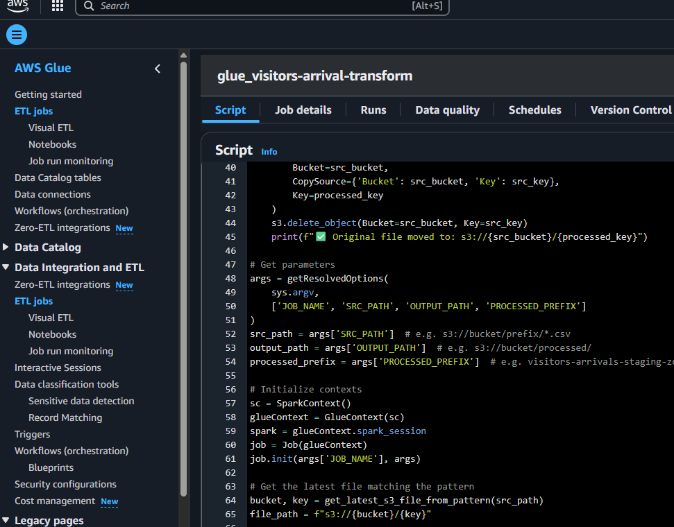

# 🗃️ AWS Data Pipeline for Tourism Demand Statistics on Visitor Arrivals to the Philippines (2023)

This project outlines an end-to-end data pipeline using AWS services to process PDF files, convert them to Parquet, and make them queryable using Amazon Athena. Power BI is planned for future integration to visualize the processed data.

---

## 📌 Overview

1.  📥 A **PDF file** is manually scraped/downloaded from the official Philippine government open data portal:  
   🔗 [Tourism Demand Statistics on Visitor Arrivals to the Philippines](https://data.gov.ph/index/public/dataset/Tourism%20Demand%20Statistics%20on%20Visitor%20Arrivals%20to%20the%20Philippines/pqj5mu1b-5tsg-7dcb-oj3y-s1jcu1ys2h3a)
2. ☁️ The file is manually uploaded to an **Amazon S3 Landing Zone** bucket.
3. 🔔 An **S3 event** triggers a **Lambda function** that:
   - Parses and extracts tabular data from the PDF
   - Cleans and transforms the data into **CSV** format
   - [Lambda Function Code](lambda_function/lambda-visitors-arrival-extract.py)
   
4. 📄 The resulting CSV is saved to the **S3 Staging Zone**.
5. 🔄 Another S3 event triggers a **second Lambda function** that initiates an **AWS Glue Job**.
6. 🧹 The **Glue Job**:
   - Cleans and transforms the CSV data
   - Converts it into **Parquet** format
   - Saves it to the **S3 Final Zone**, partitioned by **Year/Month/Type**
   - [Glue Job Code](glue_job/glue_visitors-arrival-transform.py)
7. 🕷️ Run Crawler on demand to update Data Catalog
8. 🔠The data is queried using **Amazon Athena** for analysis.
9. 📊 In future development, **Power BI** will connect to Athena for enterprise-level reporting.

---

## Architectural Diagram

---

## 🛠️ Stack

- **AWS S3** – Storage zones (Landing, Staging, Final)
- **AWS Lambda** – Serverless ETL trigger and execution
- **AWS Glue** – Data transformation and Parquet conversion
- **Amazon Athena** – Serverless querying
- **Power BI (Future)** – Analytics and reporting
  
---

## 🚧 Future Improvements

- Automate PDF scraping via scheduled jobs
- Integrate **Power BI** dashboards with live Athena queries
- Implement CI/CD for Lambda and Glue deployments

---

